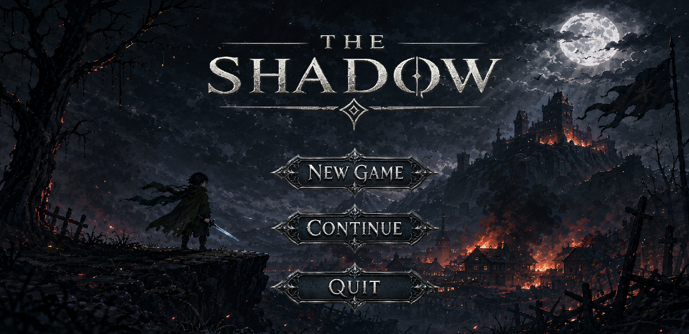
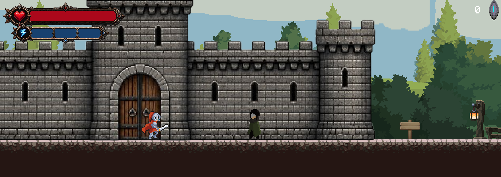
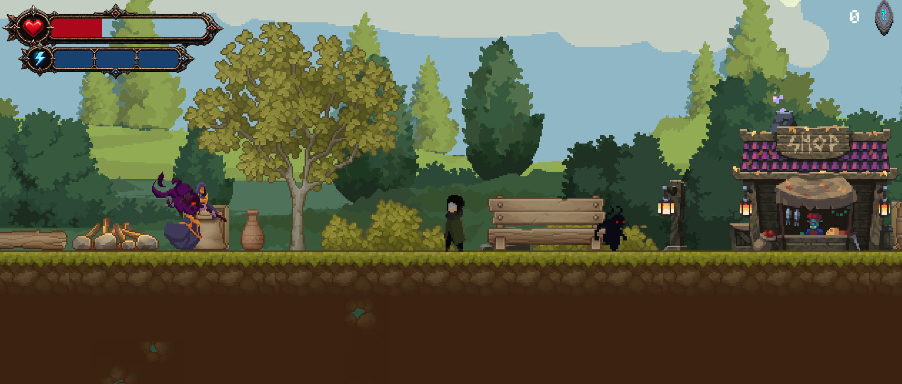
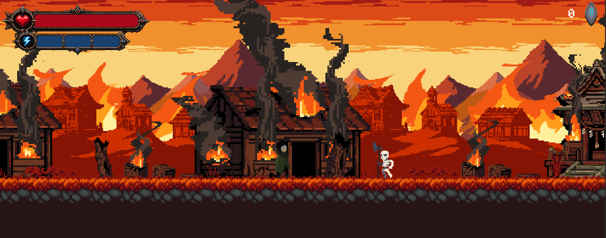
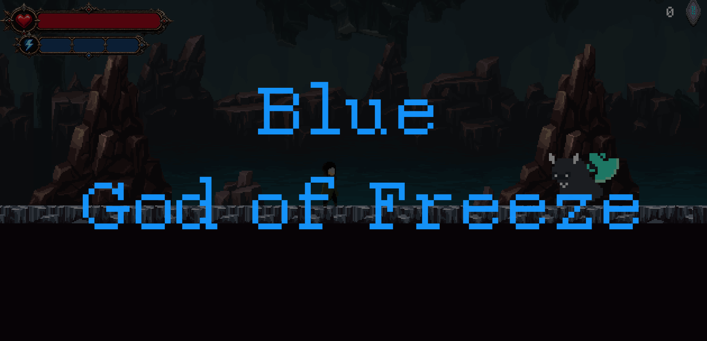
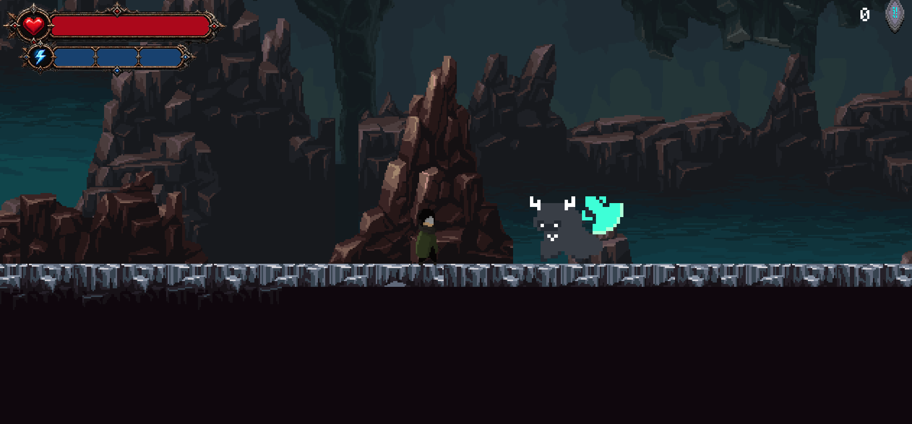
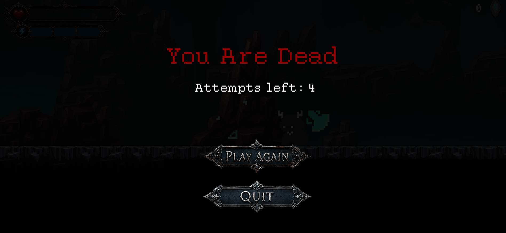

# 🌑 THE SHADOW

<p align="center">
  <strong>Godot 4.6 ve GDScript ile geliştirilen 2D karanlık-fantezi aksiyon platform oyunu</strong>
</p>

<p align="center">
  <a href="README.md">English</a>
</p>

<p align="center">
  
  
  
  
  
</p>

## Oyun Hakkında

**THE SHADOW**, akıcı hareket, yönlü savaş sistemi, davranış tabanlı düşman yapay zekâsı, özel boss karşılaşması, checkpoint sistemi, kalıcı save/continue mantığı, rune ilerlemesi, ability mağazası, tuzaklar, kullanıcı arayüzü ve farklı pixel-art ortamlarını bir araya getiren sistem odaklı bir 2D action-platformer projesidir.

Proje **Godot 4.6** ve **GDScript** ile geliştirildi. OpenAI Codex; hata ayıklama, kod iterasyonu, uygulama desteği ve geliştirme sürecini hızlandırmak için AI destekli mühendislik aracı olarak kullanıldı. Gameplay tasarımı, scene yapımı, entegrasyon, test, dengeleme kararları ve proje yönü geliştirme sürecinin parçası olarak yürütüldü.

> **Mevcut geliştirme durumu:** portföy sürümü Godot üzerinde açılıp başarıyla çalıştırılmıştır. Ana oynanış sistemleri çalışmaktadır. Haritalar arası portal/teleport altyapısı mevcut olmakla birlikte bazı map bağlantıları halen geliştirilmektedir.

## 🎮 Oynanış Görselleri

### Ana Menü

<p align="center">
  
</p>

Oyunda **New Game**, **Continue** ve **Quit** seçeneklerini içeren ana menü akışı bulunur. Continue sistemi kayıtlı checkpoint ilerlemesiyle bağlantılıdır.

### Dünya ve Bölümler

<table>
  <tr>
    <td width="50%"></td>
    <td width="50%"></td>
  </tr>
  <tr>
    <td align="center"><strong>Kale Bölgesi</strong></td>
    <td align="center"><strong>Köy Bölgesi</strong></td>
  </tr>
</table>

<p align="center">
  
  <br><strong>Yanan Bölge</strong>
</p>

Farklı level'lar kendilerine özgü çevre tasarımı ve atmosfer sunarken; düşman, hazard, checkpoint, UI ve player kontrol sistemleri ortak gameplay altyapısını kullanır.

## ⚔️ Oyuncu Hareketi ve Savaş Sistemi

Ana player controller `CharacterBody2D` kullanır ve şu özellikleri içerir:

- Anlık hız yerine acceleration tabanlı yatay hareket
- Yerde friction ve havada ayrı air-friction davranışı
- Gravity tabanlı zıplama ve platform mekaniği
- Yöne göre karakter dönüşü ve animation state yönetimi
- Normal Dash ve görsel feedback
- Mağazadan açılan daha hızlı **Special Dash**
- Special Dash için en fazla **3 charge**, tüketim ve zamanla yeniden dolum
- Health ve dash durumunu dinamik gösteren HUD
- Knockback, geçici invincibility, damage ve death state'leri
- Checkpoint tabanlı respawn
- Freeze status effect ve süreli recovery

### Yönlü Combat

Savaş sistemi `Area2D` ve `CollisionShape2D` tabanlı attack bölgeleriyle çalışır:

- Ön saldırı
- Yukarı saldırı
- Havada aşağı saldırı
- Karakter yönüne göre değişen hitbox
- Zaman kontrollü combo pencereleri
- Attack, combo ve collision state'lerinin ayrı yönetilmesi
- Damage, knockback ve hit reaction sistemi

## 🧠 Davranış Tabanlı Düşman Yapay Zekâsı

Düşmanlar yalnızca sabit animasyon oynatan objeler değildir. Projede oyuncuya ve çevreye tepki veren **Game AI / behavior-based AI** mantığı kullanılır. Bu sistem Machine Learning değil, oyun içi karar verme mantığıdır.

Genel karar akışı:

**Oyuncuyu Algıla → Hedefi Takip Et → Yön/Hareket Kararı → Mesafeyi Değerlendir → Saldırı Kararı → Attack Timing → Hasar/Ölüm State'i**

### Standart Enemy

- Player detection ve target tracking
- Attack range değerlendirmesi
- Zaman kontrollü attack hit
- Damage ve knockback
- Death state ve rune ödülü

### Skeleton

- Patrol benzeri hareket
- Kenar ve duvar farkındalığı
- Encounter sırasında oyuncuya yönelme
- Yakın mesafe zaman kontrollü attack
- Varsayılan **3 can**
- Hit reaction ve rune ödülü

### Wizard

- Kenar/duvar farkındalığı
- Player-facing combat davranışı
- Birden fazla saldırı animasyonu (`attack` / `attack2`)
- Attack çeşitliliği
- Eski gecikmeli saldırıların yanlış zamanda hasar vermesini engelleyen Attack-ID sistemi
- Varsayılan **5 can**
- Yapılandırılmış saldırılar **2 damage** verebilir
- Standart düşmanlardan daha yüksek rune ödülü

### Guard

Guard, Skeleton ve Wizard'dan farklı olarak kendi movement, wait, turn ve navigation davranışlarını yöneten ayrı bir controller kullanır.

## 👑 BLUE — Adaptif Boss Karşılaşması

<table>
  <tr>
    <td width="50%"></td>
    <td width="50%"></td>
  </tr>
  <tr>
    <td align="center"><strong>Boss Girişi</strong></td>
    <td align="center"><strong>Boss Savaşı</strong></td>
  </tr>
</table>

**BLUE**, standart düşmanlardan daha gelişmiş ayrı bir behavior/state sistemine sahiptir. Tek bir sabit animasyon sırasını tekrarlamak yerine oyuncunun konumu ve mesafesine göre davranışını yeniden değerlendirir.

### Boss AI ve Karar Mekanizması

- Oyuncuyu algılama ve target tracking
- Sürekli oyuncuya yönelme
- **Mesafeye göre aksiyon seçimi**
- Oyuncu uzaktaysa dash/chase ile yaklaşma
- Combat mesafesinde saldırıya geçme
- İki randomized attack tipi
- Saldırılar için ayrı damage değerleri ve zaman kontrollü hit pencereleri
- Damage, hit-reaction ve death state'leri
- Boss health UI ile runtime senkronizasyon
- Varsayılan **15 can**

Boss karar akışı kavramsal olarak:

**Oyuncuyu Takip Et → Mesafeyi Ölç → Chase / Dash / Attack Seç → Aksiyonu Uygula → Oyuncunun Yeni Konumunu Tekrar Değerlendir**

### ❄️ Freeze Mekaniği

BLUE'nun saldırılarından biri oyuncuya **Freeze** status effect uygulayabilir. Player controller geçici olarak frozen state'e girer, özel görsel feedback gösterir ve yapılandırılmış sürenin ardından normale döner. Böylece boss saldırısı yalnızca normal health damage değil, oyuncunun status/state sistemiyle etkileşim kuran bir mechanic oluşturur.

### ⚡ Arena Repositioning / Teleport

BLUE, boss arenası içinde önceden belirlenmiş **teleport noktaları** arasında yeniden konumlanabilir. Oyuncunun mevcut pozisyonu bu konumlandırma mantığında dikkate alınır. Böylece savaş mesafesi değişir ve oyuncu yeni duruma adapte olmak zorunda kalır.

## 💎 Rune Ekonomisi ve Ability Mağazası

Yenilen düşmanlar rune kazandırabilir. `GameManager` rune ekonomisini yönetir ve Rune UI mevcut miktarı gösterir.

Shop sistemi:

- Player proximity detection
- `E` ile interaction
- Shop UI açma / kapatma
- Ayarlanabilir ability fiyatı
- Yetersiz rune uyarısı
- Daha önce satın alınmış ability kontrolü
- `GameManager` üzerinden satın alma doğrulaması

Mevcut satın alınabilir ability **Special Dash**'tir.

## ❤️ HUD ve Oynanış Geri Bildirimi

Runtime UI sistemleri:

- Health / heart göstergesi
- Health fill UI
- Special Dash charge göstergesi
- Rune counter
- Death Menu
- Interactive message UI
- Transition UI
- Boss intro sunumu
- Boss adı ve health bar

Bu arayüzler gameplay state'ine göre dinamik olarak güncellenir.

## 💾 Checkpoint, Save ve Continue

Kalıcı ilerleme, Autoload olarak çalışan `SaveManager` ve Godot `ConfigFile` ile yönetilir.

Checkpoint aktive edildiğinde:

- Mevcut scene path
- Checkpoint world position
- Geçerli checkpoint bilgisi

saklanır.

Save dosyası:

```text
user://save_game.cfg
```

Continue akışı kayıtlı scene'i ve checkpoint pozisyonunu geri yükler. Respawn sırasında player position, health, movement/combat state'leri, freeze state, attack collision ve animation state sıfırlanır.

## 💀 Ölüm ve Retry Akışı

<p align="center">
  
</p>

Projede özel death state ve retry akışı bulunur. Kalan deneme sayısı oyuncuya gösterilir ve yeniden oynama veya oyundan çıkma seçenekleri sunulur.

## 🌍 Level, Portal ve İlerleme

Kaynak projede `level_2`, `level_3_new` ve `level_4` gibi birden fazla level scene bulunur.

Portal / transition altyapısı:

- Player proximity detection
- `E` interaction
- Portal activation animasyonu
- Transition ekranı
- İlerleyen transition text ve animated dots
- Scene değişmeden önce confirmation state
- `PackedScene` target ataması
- `change_scene_to_packed()` ile Godot scene switching

> **Geliştirme notu:** portal/teleport altyapısı uygulanmıştır ancak bazı map-to-map bağlantıları halen final entegrasyon gerektirir.

## 🌅 Çevresel Geçiş

`day_night_controller.gd`, `CanvasModulate` kullanarak oyuncunun level içindeki yatay ilerlemesine göre atmosferi daha açık sabah tonlarından akşam tonlarına doğru interpolate eder.

## ⚠️ Tuzaklar ve Etkileşimli Dünya

Projede yeniden kullanılabilir çeşitli sistemler bulunur:

- Spike damage
- Kill zone / instant death alanları
- Saw trap ve level-specific varyasyonlar
- Fire hazard
- Moving / vertical platform
- Environment objeleri ve dekorasyon
- Sign / player message sistemleri
- Spawn point ve portal objeleri

## 🕹️ Varsayılan Kontroller

| Aksiyon | Tuş |
|---|---|
| Sola Git | Sol Ok |
| Sağa Git | Sağ Ok |
| Zıpla | Space |
| Ön Saldırı | Z |
| Yukarı Saldırı | Yukarı Ok |
| Aşağı Saldırı | Aşağı Ok |
| Dash | C |
| Special Dash | X |
| Etkileşim / Portal / Shop | E |

## 🧰 Teknolojiler ve Godot Özellikleri

| Teknoloji / Özellik | Kullanım |
|---|---|
| Godot 4.6 | Oyun motoru |
| GDScript | Gameplay ve sistem scriptleri |
| CharacterBody2D | Oyuncu / karakter hareketi |
| Area2D / CollisionShape2D | Combat, detection, hazard ve trigger |
| AnimatedSprite2D | Karakter, düşman ve dünya animasyonu |
| GPUParticles2D | Freeze / gameplay feedback |
| ConfigFile | Save/checkpoint kalıcılığı |
| Autoload | Global save-management logic |
| Tween | UI ve sunum animasyonları |
| CanvasModulate | Çevresel renk geçişi |
| PackedScene | Portal / level target referansları |

## 🏗️ Proje Yapısı

Orijinal Godot kaynak paketi yaklaşık **47 GDScript** ve **30 `.tscn` scene** içerir. Player mechanics, enemy AI, boss behavior, checkpoint, save management, UI, progression, hazards, portals ve environment sistemleri farklı script/scene yapılarıyla yönetilir.

```text
project.godot
scripts/
├── checkpoint.gd
├── game_manager.gd
└── save_manager.gd
blue.gd
shop.gd
docs/
└── images/
    ├── main-menu.png
    ├── castle-level.png
    ├── village-level.png
    ├── burning-area.png
    ├── boss-intro.png
    ├── boss-encounter.png
    └── death-screen.png
```

Godot `res://` resource bağlantılarının bozulmaması için kaynak yapı, bağımlı path'lerde mümkün olduğunca korunmuştur.

## 🤖 Codex ile AI Destekli Geliştirme

OpenAI Codex şu alanlarda mühendislik asistanı olarak kullanıldı:

- GDScript debugging
- Gameplay logic iterasyonu
- Scene/script entegrasyon problemlerini inceleme
- Sistemleri refactor etme ve geliştirme
- Deneme ve geliştirme sürecini hızlandırma

Bu kullanım **AI-assisted development** olarak sunulur; otonom oyun üretimi olarak değil. Gameplay kararları, scene construction, integration, tuning, test ve proje yönü geliştirme sürecinin parçasıdır.

## 🚀 Projeyi Çalıştırma

1. **Godot 4.6** veya uyumlu Godot 4.x sürümünü kurun.
2. Repository'yi clone edin veya indirin.
3. Godot Project Manager'ı açın.
4. `project.godot` dosyasının bulunduğu klasörü import edin.
5. Godot'un gerekirse assetleri işlemesini bekleyin.
6. Projeyi editörden çalıştırın.

```bash
git clone https://github.com/safialajati2-creator/the-shadow-game.git
cd the-shadow-game
```

## ✅ Doğrulama ve Mevcut Durum

Portföy hazırlığı sırasında:

- Kaynak paket export edilmiş executable yerine Godot source project olarak incelendi
- `project.godot` ve proje yapısı kontrol edildi
- Temizlenen paket üzerinde statik `res://` referans kontrolleri yapıldı
- Temiz portföy kopyası geliştiricinin bilgisayarında Godot'a import edilerek başarıyla çalıştırıldı
- Map-to-map portal entegrasyonunun tamamlanması aktif geliştirme maddesi olarak bırakıldı

## 🎨 Assetler ve Haklar

Projede game-development assetleri, fontlar, audio, custom/generated artwork ve üçüncü taraf asset paketleri bulunur. İlgili orijinal lisans koşulları geçerliliğini korur. Repository bir **game-development ve software-engineering portföy projesi** olarak sunulmaktadır.

## 🎯 Bu Proje Neyi Gösteriyor?

THE SHADOW; **Godot 4, GDScript, player controller, platformer physics, directional combat, combo logic, collision tabanlı hit sistemleri, behavior-based enemy AI, target tracking, patrol/çevre farkındalığı, adaptif boss logic, mesafeye göre karar verme, chase/dash behavior, arena repositioning, status effects, checkpoint, persistence, UI/HUD, progression economy, ability unlocking, environmental effects, debugging ve AI-assisted development** konularındaki uygulamalı deneyimi gösterir.

## Geliştirici

Software Developer · Business Automation · AI-Assisted Development · Godot 4

[GitHub](https://github.com/safialajati2-creator) · [LinkedIn](https://www.linkedin.com/in/mustafa-alajati-8a1aa4286/?isSelfProfile=true) · [Email](mailto:Safialajati2@gmail.com)
